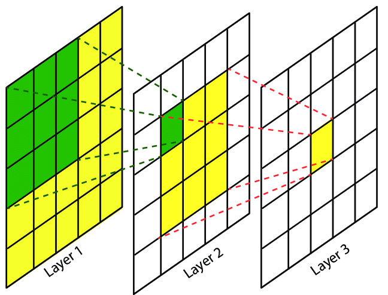
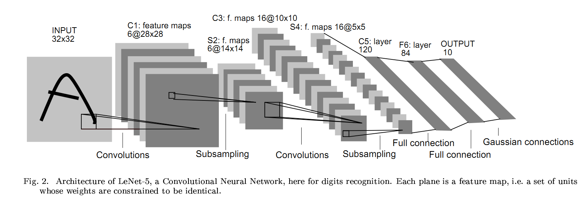

# Datawhale 零基础入门CV赛事-Task3 字符识别模型     

## 3 数据读取与数据扩增
      
本章将会讲解卷积神经网络（Convolutional Neural Network, CNN）的常见层，并从头搭建一个字符识别模型。     
     
## 3.1 学习目标     
- 学习CNN基础和原理      
- 使用Pytorch框架构建CNN模型，并完成训练      
      
## 3.2 CNN介绍      
卷积神经网络（简称CNN）是一类特殊的人工神经网络，是深度学习中重要的一个分支。CNN在很多领域都表现优异，精度和速度比传统计算学习算法高很多。特别是在计算机视觉领域，CNN是解决图像分类、图像检索、物体检测和语义分割的主流模型。      
          
CNN每一层由众多的卷积核组成，每个卷积核对输入的像素进行卷积操作，得到下一次的输入。随着网络层的增加卷积核会逐渐扩大感受野，并缩减图像的尺寸。        
             
            
                  
CNN是一种层次模型，输入的是原始的像素数据。CNN通过卷积（convolution）、池化（pooling）、非线性激活函数（non-linear activation function）和全连接层（fully connected layer）构成。      

如下图所示为LeNet网络结构，是非常经典的字符识别模型。两个卷积层，两个池化层，两个全连接层组成。卷积核都是5×5，stride=1，池化层使用最大池化。    
     
           
           
通过多次卷积和池化，CNN的最后一层将输入的图像像素映射为具体的输出。如在分类任务中会转换为不同类别的概率输出，然后计算真实标签与CNN模型的预测结果的差异，并通过反向传播更新每层的参数，并在更新完成后再次前向传播，如此反复直到训练完成 。
         
与传统机器学习模型相比，CNN具有一种端到端（End to End）的思路。在CNN训练的过程中是直接从图像像素到最终的输出，并不涉及到具体的特征提取和构建模型的过程，也不需要人工的参与。
       
## 3.3 CNN发展      
随着网络结构的发展，研究人员最初发现网络模型结构越深、网络参数越多模型的精度更优。比较典型的是AlexNet、VGG、InceptionV3和ResNet的发展脉络。      
![]
